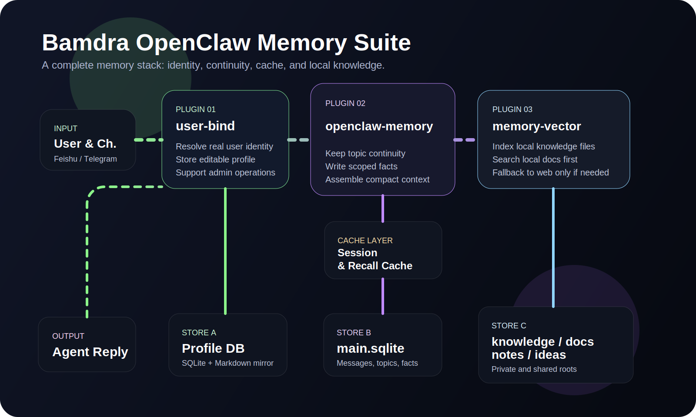

# bamdra-user-bind


The identity and living profile layer for the Bamdra suite.

It can run independently, and it is also auto-provisioned by `bamdra-openclaw-memory`.

Install directly:

```bash
openclaw plugins install @bamdra/bamdra-user-bind
```

Release package:

- GitHub Releases: https://github.com/bamdra/bamdra-user-bind/releases
- You can also build a local release bundle with `pnpm package:release`

[中文文档](./README.zh-CN.md)

## What it does

`bamdra-user-bind` turns raw channel sender IDs into a stable user boundary.

It also becomes the user's evolving profile layer, including:

- `userId`-scoped preferred address
- timezone
- tone preferences
- role
- long-lived user notes

Recent behavior improvements:

- channel-scoped user IDs now make profile ownership explicit across Feishu, Telegram, WhatsApp, Discord, Google Chat, Slack, Mattermost, Signal, iMessage, and Microsoft Teams
- when a stable binding is temporarily unavailable, the runtime can persist a provisional profile first and merge it into the stable profile later
- profile updates now support semantic `replace`, `append`, and `remove` instead of only blind overwrite
- the Markdown mirror now keeps frontmatter as the machine-readable source and renders a synchronized `Confirmed Profile` section for humans

## Profile Policy

- `userId` is the primary key for personalization
- preferred address should live in the bound profile, not in scattered workspace `USER.md` files
- workspace `USER.md` should stay minimal and only keep environment facts
- if the current turn explicitly asks for a different address, follow the current turn
- admin tools are for repair, merge, audit, and sync, not for blind bulk rewriting

## Why it matters

Without an identity layer:

- the same person can fragment across channels or sessions
- memory can attach to the wrong boundary
- personalization becomes fragile

With it:

- user-aware memory becomes stable
- personalization survives new sessions
- the assistant can gradually adapt to the user's style and working habits

## Storage model

- primary store:
  `~/.openclaw/data/bamdra-user-bind/profiles.sqlite`
- editable Markdown mirrors:
  `~/.openclaw/data/bamdra-user-bind/profiles/private/{userId}.md`
- export directory:
  `~/.openclaw/data/bamdra-user-bind/exports/`

The SQLite store is the controlled source of truth.

The Markdown mirror is for humans, so profiles stay editable like a living per-user guide instead of becoming a hidden black box.

## Profile update semantics

Not every durable user preference should overwrite the entire old field.

`bamdra-user-bind` now distinguishes between:

- `replace`: the user is correcting or changing an earlier durable preference
- `append`: the user is adding another durable preference without revoking the old one
- `remove`: the user explicitly wants one older durable trait removed

This is especially useful for fields like `preferences`, `personality`, and `notes`, where the right behavior is often incremental.

## Provisional identity and later merge

Some channels or app states can temporarily fail to resolve a stable bound identity on the first turn.

In those cases, the runtime can:

- persist a provisional profile immediately so the user's newly stated preferences are not lost
- keep trying to repair the binding in the background
- merge the provisional profile into the stable user profile once the real binding is available

This keeps the user experience responsive without turning missing identity resolution into data loss.

## Best practice

- keep SQLite local
- keep profile mirrors private
- let humans edit the mirror gradually
- use admin tools only for audit, merge, repair, and maintenance
- when updating how someone is addressed, update the bound profile for that `userId` first

## Architecture



## What it unlocks

With `bamdra-openclaw-memory`:

- memory becomes user-aware instead of session-only

With `bamdra-memory-vector`:

- private notes stay private while still influencing local recall

## Repository

- [GitHub organization](https://github.com/bamdra)
- [Repository](https://github.com/bamdra/bamdra-user-bind)
- [Releases](https://github.com/bamdra/bamdra-user-bind/releases)
