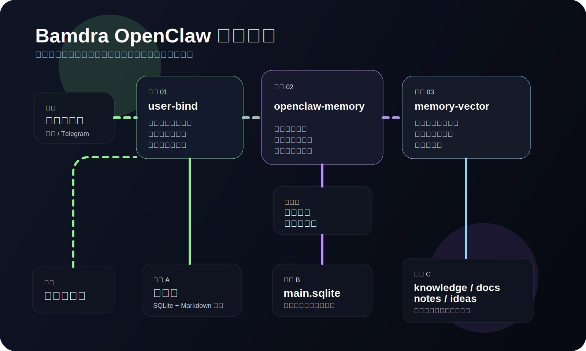

# bamdra-user-bind


Bamdra 套件中的身份与“活画像”层。

它可以独立运行，也会被 `bamdra-openclaw-memory` 自动补齐。

已验证适配 OpenClaw `v2026.3.23`。

单独安装：

```bash
openclaw plugins install @bamdra/bamdra-user-bind
```

发布包下载：

- GitHub Releases: https://github.com/bamdra/bamdra-user-bind/releases
- 本地也可以执行 `pnpm package:release` 生成独立发布包

[English README](./README.md)

## 它做什么

`bamdra-user-bind` 会把渠道里的原始 sender ID 转成稳定用户边界。

同时，它也会逐渐成为用户持续演化的画像层，包括：

- userid 级别的默认称呼
- 时区
- 语气偏好
- 角色
- 长期用户备注

这轮又补了几件关键的事：

- 用户画像主键现在带 channel 作用域，像 Feishu、Telegram、WhatsApp、Discord、Google Chat、Slack、Mattermost、Signal、iMessage、Microsoft Teams 这些渠道的归属会更清楚
- 当稳定绑定暂时拿不到时，运行时可以先落一份 provisional 画像，后续补到真实绑定后再自动归并
- 画像更新现在支持语义上的 `replace / append / remove`，不再只有整段覆盖
- Markdown 镜像继续保留 frontmatter 作为机器主源，并把正文里的“已确认画像”变成同步的人类可读镜像
- 在 OpenClaw `v2026.3.23` 下通过 npm 安装时，现在会自动补齐 `plugins.installs` 元数据，并把 `~/.openclaw/...` 正确解析到当前用户目录

## 画像策略

- `userId` 是画像的主键
- 默认称呼应当写入该 `userId` 的画像，而不是散落在各个工作区 `USER.md`
- `USER.md` 只保留运行环境事实，不负责称呼
- 当当前会话显式要求不同称呼时，以当前会话为准
- 管理员只做修复、合并、审计和同步，不做批量越权改写

## 为什么重要

没有身份层时：

- 同一个人可能在不同渠道或会话里碎片化
- 记忆可能挂错边界
- 个性化很难稳定

有了它之后：

- user-aware 记忆会稳定下来
- 个性化会跨 session 持续存在
- 智能体会逐步适应用户的风格和习惯

## 存储模型

- 主存储：
  `~/.openclaw/data/bamdra-user-bind/profiles.sqlite`
- 可编辑 Markdown 镜像：
  `~/.openclaw/data/bamdra-user-bind/profiles/private/{userId}.md`
- 导出目录：
  `~/.openclaw/data/bamdra-user-bind/exports/`

SQLite 是受控主源。

Markdown 镜像则是给人编辑的，让用户画像更像一份活的 per-user 指南，而不是一个无法触达的黑盒。

## 画像更新语义

不是所有长期偏好变化都应该直接覆盖旧字段。

`bamdra-user-bind` 现在会区分：

- `replace`：用户是在纠正或替换旧偏好
- `append`：用户是在追加一个新的长期偏好，并没有撤销旧偏好
- `remove`：用户明确希望移除某一个旧特征

这对 `preferences`、`personality`、`notes` 这类字段尤其重要，因为它们很多时候更适合增量维护。

## 临时身份与后续归并

某些渠道或某些 App 状态下，第一轮对话不一定立刻能解析出稳定绑定。

这时运行时会：

- 先把用户刚表达出来的稳定偏好写进 provisional 画像，避免信息丢失
- 在后台继续主动补绑定
- 一旦补到真实绑定，就把 provisional 画像自动归并到正式画像

这样即使当前身份链路暂时不完整，也不会让用户刚说的偏好白白丢掉。

## 最佳实践

- SQLite 留在本地
- 画像镜像保持私有
- 让人逐步维护画像镜像
- 管理员能力只用于审计、合并、修复和维护
- 当你要改称呼时，优先改 `userId` 对应画像，不要去改 workspace 的 `USER.md`

## 架构图



## 它能解锁什么

与 `bamdra-openclaw-memory` 组合时：

- 记忆会从 session-only 变成真正的 user-aware

与 `bamdra-memory-vector` 组合时：

- 私有笔记既能保持私有，又能影响本地召回

## 仓库地址

- [GitHub 首页](https://github.com/bamdra)
- [仓库地址](https://github.com/bamdra/bamdra-user-bind)
- [Releases](https://github.com/bamdra/bamdra-user-bind/releases)
